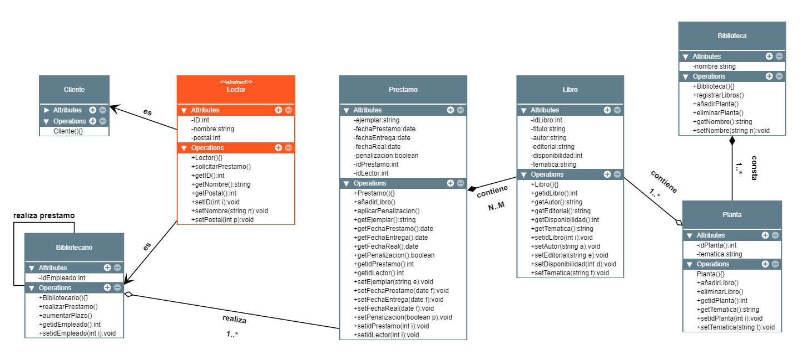

# Examen Entornos de Desarrollo - Tercera evaluación  
## Multiplicidad / Relaciones  (Explicación)
***Lector - Cliente y Bibliotecario:*** aquí tenemos una relación de herencia, donde tanto Cliente como Bibliotecario heredarán de Lector unos atributos comunes, así como el método *solicitarPrestamo*. Además, la clase Bibliotecario contará con un ID y métodos propios. Estos métodos serán *aumentarPlazo*, puesto que el enunciado nos indica que los bibliotecario pueden llevarse un libro por más tiempo que un cliente normal, y luego tenemos el método *realizarPrestamo* que como también nos indica el enunciado, son los Bibliotecarios los encargados de reaizar los préstamos a los Clientes.  
***Bibliotecario - Bibliotecario:*** relación reflexiva, debido a que los Bibliotecarios pueden realiza Prestamos de libros para ellos mismos.  
***Bibliotecario - Préstamo:*** relación de agregación, puesto un Bibliotecario puede o no realizar un Préstamo (se puede llegar a entender una clase sin la otra), y multiplicidad "1 a muchos", ya que un bibliotecario puede realizar muchos Préstamos, pero un préstamo en concreto solo lo realiza un Bibliotecario específico.  
***Préstamo - Libros:*** relación de composición, ya que no se puede entender un Préstamo sin Libros (no puede existir). La multiplicidad es "N a M", ya que un Préstamo puede tener muchos Libros, y un Libro (Don Quijote, por ejemplo) puede estar en varios Préstamos. Cabe destacar que como la clase Préstamo contiene las fechas de entrega, devolución, etc he pasado como parámetro el ID del Lector y he añadido un método *aplicarPenalizacion* para aplicarla en caso de que se pasen los 30 días de plazo que indica el enunciado. Por último he añadido un un atributo en la clase Libro llamado "disponibilidad" para controlar cuantas unidades de un Libro hay disponibles para la hora de realizar un Préstamo. 
***Libros - Planta:*** relación de agregación, ya que una Planta puede no tener Libros en un momento determinado (puede existir sin libros). Multiplicidad "1 a muchos", debido a que una Planta puede contener muchos Libros, pero un Libro solo pertenece a una Planta. Cabe señalar que tanto a la clase Libro como Planta he añadido el atributo "temática" para que claramente se puedan identificar a dónde pertenecen cada uno de ellos. Todo ello, a la hora de añadir los libros en las respectivas Plantas con el método *añadirLibro* que he creado dentro de la clase de ésta última. También hay un método *eliminarLibro* si así se desea.
***Biblioteca - Planta:*** relación de composición, ya que ésta Biblioteca municipal se compone de diferentes Plantas sí o sí. Multiplicidad "1 a muchos", ya que esta Biblioteca contiene varias plantas, como he comentado antes, y una Planta solo pertenece a esta Biblioteca. He añadido un método en la clase Biblioteca llamdo *registrarLibro* porque en el enunciado se indica que se desean registrar los libros que existen, y he creído que esta era la clase idónea para implementarlo.  
## Diagrama UML  

